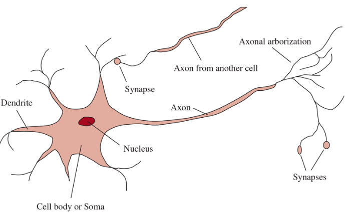

# The Foundations of Artificial Intelligence

### Philosophy

- Aristotle first formalized the laws of thought, establishing foundations for rational thinking
- Ramon Llull created a mechanical device for generating logical arguments
- Leonardo da Vinci designed (but never built) a mechanical calculator
- Gottfried Wilhelm Leibniz developed a machine to operate on concepts rather than numbers
- Thomas Hobbes proposed that reasoning was essentially computation
- René Descartes contributed significant discussions on mind-body duality
- **Dualism**: The philosophical position that mind and body are distinct entities - mind being nonphysical, body being physical
- **Materialism**: The view that the mind is purely physical, essentially equating it with the brain
- David Hume proposed the principle of induction
- **Induction**: The logical process of deriving general principles from specific instances

### Mathematics

- George Boole developed Boolean algebra, a system for representing logical statements
- Gottlob Frege extended Boolean logic to create first-order logic
- Probability theory emerged as a way to apply logic to uncertain situations
- Statistics developed from the formalization of probability and availability of data
- **Al-Khwarizmi**: Persian mathematician who introduced algorithmic thinking to mathematics

### Economics

- Adam Smith's "The Wealth of Nations" introduced systematic thinking about rational agents and resource allocation

### Neuroscience

- Neuroscience is the study of the nervous system.
  

### Psychology

- Cognitive psychology studies human information processing and decision making

### Computer Engineering

- Development of digital computers enabled practical implementation of AI concepts

### Control Theory and Cybernetics

- Control theory provides frameworks for designing self-regulating systems
- Cybernetics studies control and communication in machines and living things

### Linguistics

- Noam Chomsky's work on generative grammar influenced AI research
