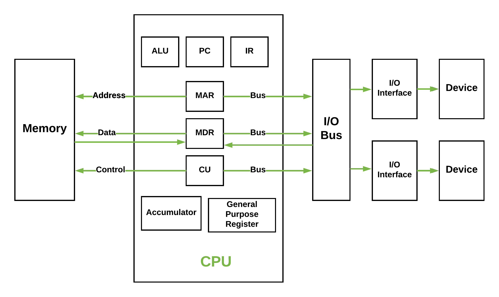

# Tutorial Worksheet 01: Operating systems

## Exercise 1:
### 1. Understanding Fundamental Concepts:

a. **What is a system?** 
A system is a set of interconnected components that work together to achieve a common goal.

b. **Operating system (OS):**
Is a set of modules (programs) that cooperate together for the good managment of the computer resources.

c. **The operating system modules:**
**Primary modules (kernel):**
1. Process management
2. Memory management
3. File management
4. Interrupt handler module

**Secondary modules:**
1. Device drivers
2. Network drivers
3. User interface (UI) modules
4. Shell
5. Security management modules

d. **The difference between system software and application software:**
System software is designed to manage and control computer hardware and provide a platform for running application software, while application software is designed to perform specific tasks for the user, such as word processing or web browsing.

e. **How would you classify an operating system (system Vs application software)**
An operating system is classified as system software because it provides the essential functions and services that enable other software applications to run and interact with the hardware.

f. up to you

g. **The process of booting:**
The process of booting is the sequence of events that occurs when a computer is powered on, leading to the loading of the operating system into memory and the initialization of hardware components. It typically involves the following steps:
1. Power-on self-test (POST): The computer performs a series of diagnostic tests to check the hardware components.
2. Bootloader: The BIOS or UEFI firmware loads the bootloader from the storage device.
3. Operating system loading: The bootloader loads the operating system kernel into memory.
4. Initialization: The operating system initializes hardware components, mounts file systems, and starts system services.
5. User login: The user is prompted to log in, and the user interface is presented.
6. User session: The user can now interact with the operating system and run applications.

h. **The process of booting a computer that has multiple operating systems:**
When a computer has multiple operating systems installed, the boot process typically involves a boot manager or bootloader that allows the user to select which operating system to boot. The steps are similar to a single OS boot, but with an additional selection step:
1. Power-on self-test (POST): The computer performs hardware diagnostics.
2. Bootloader: The boot manager presents a menu of available operating systems.
3. User selection: The user selects the desired operating system from the menu.
4. Operating system loading: The selected operating system's bootloader loads the kernel into memory.
5. Initialization: The operating system initializes hardware components and starts system services.
6. User login: The user is prompted to log in to the selected operating system.

i. **BIOS and UEFI:**
BIOS (Basic Input/Output System) and UEFI (Unified Extensible Firmware Interface) are firmware interfaces that initialize hardware components during the boot process. BIOS is the traditional firmware interface, while UEFI is a modern replacement that offers more features, such as support for larger hard drives, faster boot times, and a graphical user interface. UEFI can also support secure boot, which helps protect against malware during the boot process.

### 2. Types of Operating Systems:

a. **Multiprogramming, single tasking, multi-tasking, multi-processing, multi-threading:**
- **Multiprogramming:** A method where multiple programs are loaded into memory and executed concurrently, allowing better CPU utilization.
- **Single tasking:** An operating system that allows only one program to run at a time.
- **Multi-tasking:** An operating system that allows multiple programs to run concurrently, sharing CPU time.
- **Multi-processing:** An operating system that supports multiple processors or cores, allowing multiple processes to run simultaneously on different CPUs.
- **Multi-threading:** A programming model that allows multiple threads of execution within a single process, enabling concurrent execution of tasks.

b. **Time sharing systems:**
Time-sharing systems are operating systems that allow multiple users to access the system simultaneously by sharing CPU time. Each user gets a time slice of the CPU, enabling them to interact with the system as if they were the only user. This is achieved through context switching, where the OS rapidly switches between user processes to provide the illusion of concurrent execution.

c. **Relate the  above concepts to the operating system you use everyday:**

The operating system I use every day is Arch linux which is a multi-tasking, multi-threading system that supports time-sharing. It allows me to run multiple applications simultaneously, such as a web browser, text editor, and terminal, all while managing system resources efficiently.

d. **Completing the table:**
| Operating system | Example | Brief Description |
|------------------|---------|-------------------|
| Desktop OS       | Windows, macOS, Linux | Operating systems designed for personal computers, providing a graphical user interface and support for various applications. |
| Real-time OS     | QNX, VxWorks | Operating systems designed for real-time applications, where timing and predictability are critical. |
| Embedded OS      | FreeRTOS, Embedded Linux | Operating systems designed for embedded systems, often with limited resources and specific functionality. |
| Mobile OS       | Android, iOS | Operating systems designed for mobile devices, providing touch-based interfaces and support for mobile applications. |
| Distributed OS   | Apache Hadoop, Google File System | Operating systems that manage a group of independent computers and make them appear to the user as a single coherent system. |
| Network OS       | Novell NetWare, Windows Server | Operating systems that provide services to computers connected over a network, enabling resource sharing and communication. |
| Virtualization OS| VMware ESXi, Microsoft Hyper-V | Operating systems that enable the creation and management of virtual machines, allowing multiple OS instances to run on a single physical machine. |
| Clustered OS     | Red Hat Cluster Suite, Oracle Real Application Clusters | Operating systems that manage a group of interconnected computers (clusters) to work together as a single system, providing high availability and scalability. |

e. **The type of operating system used in the following devices:**
| Device            | Operating System Example |
|-------------------|--------------------------|
| A laptop          | Desktop Os               |
| A web server      | Network Os               |
| A smartphone      | Mobile Os                |
| An ATM            | Embedded Os              |
| A self driving car| Real-time Os             |
| A jet fighter plane| Real-time Os             |
| A drone           | Real-time Os             |
| A company resource management server | Network Os               |

## Exercise 2:
### 1. Von Neumann Architecture:
a. **The Von Neumann architecture:**
The Von Neumann architecture is a computer architecture model that describes a system where the CPU, memory, and input/output devices are interconnected. It consists of the following components:
1. **Central Processing Unit (CPU):** The brain of the computer that performs calculations and executes instructions.
2. **Memory:** Stores data and instructions that the CPU can access.
3. **Input/Output (I/O) Devices:** Allow the computer to interact with the external environment, such as keyboards, mice, and displays.

b. **THe system used by the above components to communicate:**
The system used by the above components to communicate is the **system bus**, which consists of three main types of buses:
1. **Data Bus:** Transfers data between the CPU, memory, and I/O devices.
2. **Address Bus:** Carries the addresses of data and instructions, allowing the CPU to access specific memory locations.
3. **Control Bus:** Carries control signals from the CPU to other components, coordinating their operations.

c. **VNA diagram:**

d. **Harvard architecture:**
The Harvard architecture is a computer architecture that separates the storage and handling of instructions and data. It has distinct memory spaces for program instructions and data, allowing simultaneous access to both. This contrasts with the Von Neumann architecture, where instructions and data share the same memory space. It becomes de facto in modern computers.

2. **CPU and Memory:**

a. **Computation:**

- 2^11 = 2KB
- 2^20 = 1MB
- 2^23 = 8MB
- 2^29 = 512MB
- 2^37 = 128GB
- 2^46 = 64TB
- 2^55 = 32PB

b. 
- memory address: 8 bits
- memory location: 8 bytes
2^8 = 256 bytes

c. in theory 2^32 = 4GB can be addressed
d. in theory 2^16 = 64KB can be addressed

