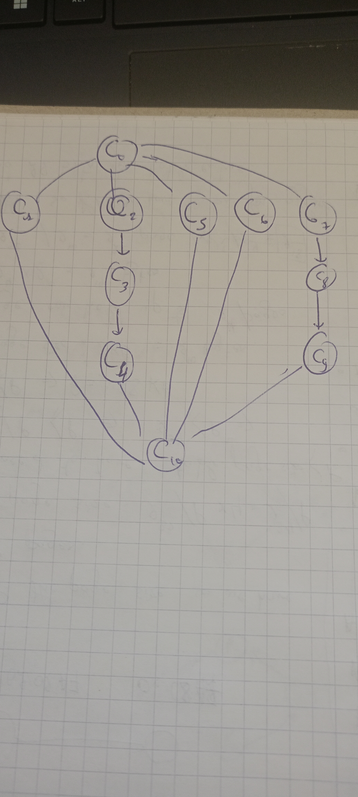
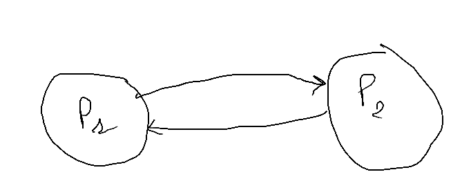

# Operating Systems - Tutorial Worksheet 03

## 1. Concepts Understanding

a) **What is a critical section in a program?**
A critical section is a part of a program where shared resources (e.g., variables, files) are accessed. To prevent race conditions and ensure data consistency, only one process should execute its critical section at a time.

b) **How did old uniprocessor operating systems handle the critical section problem?**
Older uniprocessor systems, such as early versions of Unix, handled the critical section problem by disabling interrupts during the execution of critical sections. This ensured atomicity and prevented context switches that could lead to race conditions.

c) **Explain the two styles of using semaphores.**

- **Binary Semaphores (Mutex):** These can have only two values (0 and 1) and are mainly used for mutual exclusion.
- **Counting Semaphores:** These allow a counter value greater than 1 and are used for managing access to multiple instances of a resource.

d) **Can a process be interrupted during its critical section?**
Yes, but this depends on the synchronization mechanism. In systems using spinlocks or semaphores, context switches can occur unless proper synchronization is enforced.

e) **Why is disabling interrupts during the critical section a bad idea in multiprocessor systems?**
Disabling interrupts only affects the processor executing the critical section, while other processors can still modify shared resources, leading to race conditions.

f) **Three requirements for the critical section problem:**

- **Mutual Exclusion:** Only one process can be in the critical section at a time.
- **Progress:** If no process is in the critical section, then the selection of the next process should not be postponed indefinitely.
- **Bounded Waiting:** A process must be able to enter its critical section within a finite amount of time.

g) **Advantages of using queues in acquire() and release():**

- **Avoids busy waiting**, improving CPU utilization.
- **Ensures fairness**, preventing starvation by maintaining an ordered queue.

h) **Why can't semaphores be used across different computers?**
Semaphores rely on shared memory, which is not directly accessible between different computers. Distributed synchronization mechanisms like message passing are used instead.

## 2. Race Condition and Non-Determinism

Given:

```
Process A: x = x + y
Process B: y = x * x
```

Initial values: `x = 10`, `y = 10`

Possible outcomes:

- If `Process A` executes first: `x = 20`, then `Process B`: `y = 400`.
- If `Process B` executes first: `y = 100`, then `Process A`: `x = 110`.

## 3. Critical Section

### a) Identifying Critical Sections

```
Critical Sections:
CS1: {c = x * b; a = y - 55;}
CS2: {y = t - p; x = x + 3; t = u * x; h = x * r + y;}
```

### b) Using Semaphores

```
Semaphore mutex1 = 1;
Semaphore mutex2 = 1;

// Modified Code C1
Begin
    b = r + 4;
    P(mutex1);
    c = x * b;
    V(mutex1);
    a = a % b;
End

// Modified Code C2
Begin
    P(mutex2);
    y = t - p;
    V(mutex2);
    P(mutex1);
    x = x + 3;
    t = u * x;
    h = x * r + y;
    V(mutex1);
End
```

This prevents deadlock and ensures mutual exclusion.

## 4. Process Precedence Graph

**Precedence Graph:**

<div align="center">
    
    <p><em>Figure: Process Precedence Graph showing execution dependencies</em></p>
</div>

## 5. Using Semaphores in Waiting-Style

<!-- [THE PRECEDENT GRAPH](2025-04-06-Note-10-21.pdf) -->

### a) Code with one semaphore

```
Semaphore S = 0;
ParBegin P1, P2 ParEnd

P1:
Begin
    code1;
    V(S);
End

P2:
Begin
    P(S);
    code2;
End
```

### b) Code with two semaphores

```
Semaphore S1 = 0;
Semaphore S2 = 0;

P1:
Begin
    code1;
    V(S1);
    P(S2);
    code3;
End

P2:
Begin
    P(S1);
    code2;
    V(S2);
End
```

### c) Relationship Between `i` and `j`

Since `P1` waits for `M` while `P2` releases it, `i = j+10` is the correct answer.

### d)

Yes there is a deadlock:

```
P1
Begin
    Code 1
    V(M)
End

P2
Begin
    P(M)
    Code 2
    V(N)
End

```

### e) To make P1, P2 alternating

```
P1
Begin

    while(true){
        Code 1
        V(M)
        P(N)
    }
End

P2
Begin
    while (true) {
        P(M)
        Code 2
        V(N)
    }
End

```

### f) making each p1 followed by two p2

```
M=2
N=0
P1
Begin
    while(true){
        P(N)
        P(N)
        Code 1
        V(M)
        V(M)
    }
End

P2
Begin
    while (true) {
        P(M)
        Code 2
        V(N)
    }
End

```

## 6. CoBegin/CoEnd with Precedence Graphs

```

Correct Execution Sequences: (b) , (d), (g), (h)

```

## 7. Synchronization Code with Three Semaphores

```
BEGIN
    SEMAPHORE S1 = 0;
    SEMAPHORE S2 = 0;
    SEMAPHORE S3 = 0;
    CoBegin
        P1; P2; P3; P4; P5; P6;
    CoEnd;
END

P1:
Begin
    c1;
    V(S1);
    V(S1);
    V(S1);
End

P2:
Begin
    P(S1);
    c2;
    V(S2);
End;

P3:
Begin
    P(S1);
    c3;
    V(S2);
End

P4:
Begin
    P(S1);
    c4;
    V(S3);
End

P5:
Begin
    P(S2);
    P(S2);
    c5;
    V(S3);
End

P6:
Begin
    P(S3);
    P(S3);
    c6;
End
```

## 8. Peterson’s Algorithm

- **Swapping (1) and (2) violates mutual exclusion**.
- **Using `||` instead of `&&` violates progress and bounded waiting**, because both processes will keep waiting in the while loop 

## 9. Test-and-Swap

If three processes execute simultaneously, 
the first one will execute swap key with lock then enters its critical section, the two other processes when they execute swap both of the key and the lock are set to true, than key remains true and hence the still in the loop waiting until the lock variable is freed by the first process.
## 10. Relaxing Constraints in Precedence Graphs

```
CoBegin 
    C1;
    CoBegin
        C3;
        C4;
    CoEnd;
    C2;
    CoBegin
        C7;
        C6;
    CoEnd;
    C5;
CoEnd


```

## 11. The Guarantita Problem

