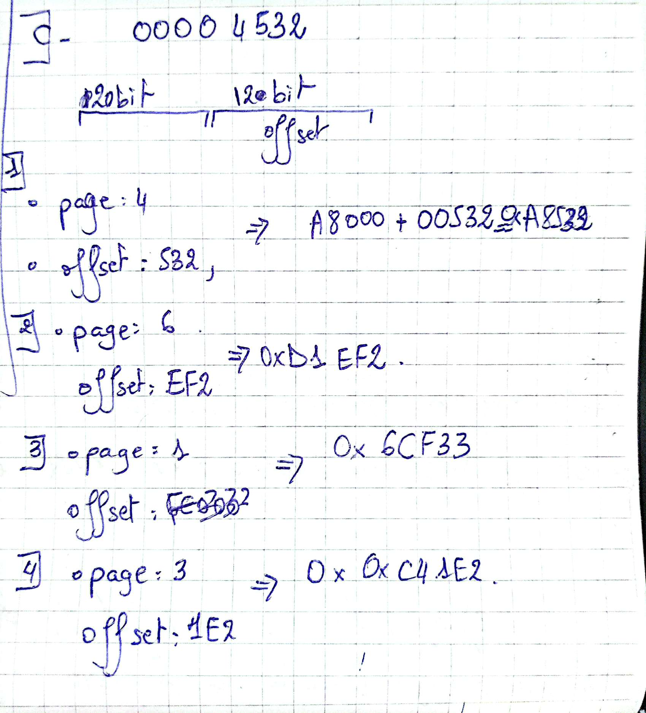

# Tutorial 05: Memory Management

1. 

a. **The difference between absolute code and relocatable code:**
   - Absolute code is compiled to run at a specific memory address, while relocatable code can be loaded at any address in memory.
   - Relocatable code requires a loader to adjust the addresses at runtime, while absolute code does not.
   - Absolute code is used in old systems like MS-DOS, while relocatable code is used in modern systems.

b. **dynamic loading** is the act of loading the libraries/code in the runtime only when needed
**dynamic linked libraries** are libraries that are linked at runtime, not at compile time

c. **The advantages of dynamic linked libraries:**
   - They save memory space by allowing multiple programs to share the same library code.
   - They allow for easier updates and bug fixes, as the library can be updated without recompiling the entire program.
   - They can reduce load time, as only the necessary parts of the library are loaded into memory.

d. The CPU uses an internal cache in order to save speed as loading data from the RAM takes too long and can waste CPU time.

e. **from source code to executable file**
- preprocessing: all the comments are removed, includes header files `.h`, and the macros are expanded `main.i`
- compilation: the source code is compiled to assembly code `main.s`
- assembly: the assembly code is converted to machine code `main.o` 
- linking: it takes the `main.o` and links it with the libraries to create the executable file `main.exe`

f. **internal fragmentation** happens when the process gets a little bit more than needed. **external fragmentation** happens between allocated blocks of memory, when there is a free block of memory but it is not big enough to hold the process.

g. Internal fragmentation never happen in segmentation because the memory is divided into segments that are the same size as the process. External fragmentation can happen in segmentation because the segments can be of different sizes and there can be free blocks of memory between them.

h. There is no external fragmentation in paging because the pages are of the same size and there is no free block of memory between them. Internal fragmentation can happen in paging because the pages are of the same size and there can be free blocks of memory between them.

i. **Virtual memory** is a memory management technique that uses both hardware and software to allow a computer to compensate for physical memory shortages by temporarily transferring data from random access memory (RAM) to disk storage. It allows a computer to use more memory than it physically has by using disk space as an extension of RAM.

j. **segmentation fault vs page fault**
- A segmentation fault occurs when a program tries to access a memory segment that it is not allowed to access, while a page fault occurs when a program tries to access a page that is not currently in memory.

k. Modern computer allow the execution of large programs by using virtual memory, which allows the computer to use more memory than it physically has by using disk space as an extension of RAM. This is done by dividing the memory into pages and segments, and using a page table to keep track of which pages are in memory and which are on disk. The operating system manages the memory and swaps pages in and out of memory as needed.

l. **trashing** is a situation where the system spends more time swapping pages in and out of memory than executing the program. This can happen when there is not enough physical memory to hold all the pages that are needed by the program, and the operating system has to constantly swap pages in and out of memory. This can lead to a significant decrease in performance and can make the system unresponsive.

2. **Central memory size:**
a. M=11, size = 2^11=2 KB
b. M=44, size = 2 ^44= 16TB
c. M=25, size = 32 MB
d. M=01, size = 2B
e. M=36, size = 64GB
f. M=27, size = 128MB

3. **Physical and logical addresses:**

Physical address =  log (32 * 1024)= 15 bit

4. **Single level paging:**
a. page size= 64KB, 8B per page 
so we have 56 possible entries in the page table, hence the size of the table is 2^ 56 * 2^3 bytes (in single paging we dont care about the program size)
b. here we have 4 level paging we the same parameters as above so:
1. level 4: 2^32/2^16 = 2^16 page entry, and we have the page offset is 12 bit, hence 2^16/ 2^12 = 2^4 page table in the level 4
2. level 3: 2^4/2^12= 1 page table
3. level 2: 1 table
4. level 1: 1 table 
so we have 16+3 table, therfore the table size is: `19*2^12*8 bytes`
c. 4KB page size means 2^12 which means the page offset is 12 bit width, and the page number is 20 bit 
*Calculating the physical addresses:*

5. **Segmentation with paging**

---
Virtual memory address | Main memory address|  there a page fault?
---
0x0000B2               | 0x0400B2           |        NO  |
---
0x020216               | 0x1A16             |        YES |
0x02015E               | 0x3B5E             |        NO  |
0x0202A7               | 0x08A7             |        YES |